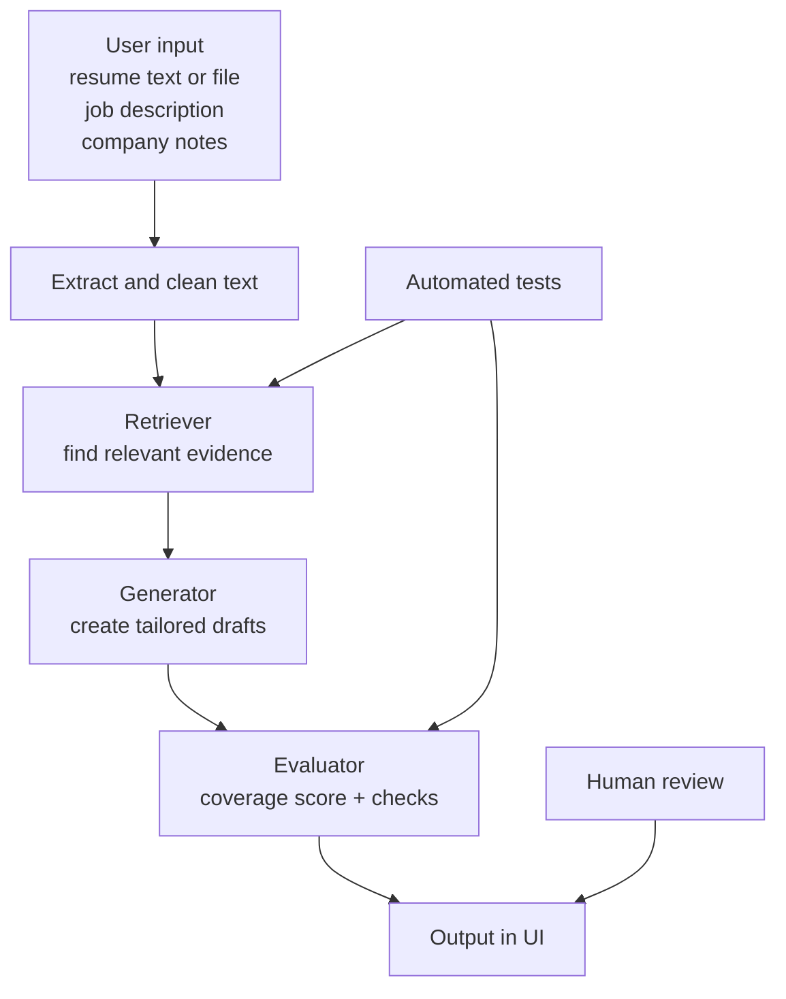

# Job Application Copilot

## Original Project

The original project is the 3rd module whihc is music reccomender system. It ranked songs using simple features like genre and mood. I kept the recommender structure but changed the task to job applications.

## What This Project Does

This AI tool helps tailor a resume to a job description. It finds relevant evidence first, then writes draft bullets, a cover letter opening, and interview talking points.

Why this matters: job applications take time, and people need clear, role-specific writing support.

## System Design



## Setup

1. Create and activate a virtual environment.

```bash
python -m venv .venv
.venv\Scripts\activate
```

2. Install dependencies.

```bash
pip install -r requirements.txt
```

3. Run terminal demo.

```bash
python -m src.main
```

4. Run Streamlit app.

```bash
python -m streamlit run src/app.py
```

5. Run tests.

```bash
pytest
```

## Video Walkthrough

Loom link: https://www.loom.com/share/a344deba570f4c2095e8ad2edb9d88be

## Sample Inputs and Outputs

### Example 1

Input:

```text
Resume: Python APIs, backend tests
Job: Backend Engineer needing Python, FastAPI, testing
```

Output:

```text
Top matches: Python API work, test automation
Draft bullet: Built and tested Python API features
```

### Example 2

Input:

```text
Resume: campaign reports, dashboards, stakeholder updates
Job: Marketing Analyst needing analytics and reporting
```

Output:

```text
Top matches: reporting, dashboards, communication
Draft bullet: Created dashboard reports and presented insights to stakeholders
```

## Reliability and Testing

- 4/4 automated tests pass.
- The app logs key steps (retrieval, analysis, score).
- Coverage score helps show confidence in grounding.
- Human review is required before using outputs in a real application.

## Reflection and Ethics (Student Voice)

- Limitation: if resume text is weak, output becomes generic.
- Bias risk: keyword matching may miss good transferable skills.
- Misuse risk: users may exaggerate qualifications.
- Mitigation: show evidence, warnings, and checks; treat output as a draft.
- Surprise: polished writing can still be weakly grounded when context is poor.

AI collaboration notes:

- Helpful: AI suggested a retrieval-first workflow that improved clarity and testing.
- Flawed: one AI UI suggestion used too much custom HTML/CSS and looked broken in Streamlit.

## Key Files

- [CLI demo](src/main.py)
- [Streamlit UI](src/app.py)
- [Core logic](src/recommender.py)
- [Tests](tests/test_recommender.py)
- [Model card](model_card.md)

