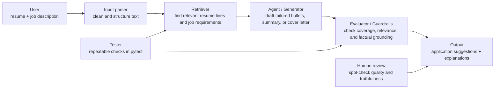

# Job Application Copilot

## Original Project

This project originally started as **Music Recommender Simulation**, a small classroom recommender that ranked songs by genre, mood, and energy. Its goal was to show how a simple scoring model can turn structured data into personalized recommendations, while also making it easy to explain why one item ranked above another.

The upgraded version turns that same recommender structure into a **Job Application Copilot**. Instead of suggesting songs, it helps a user tailor a resume, cover letter, or interview prep plan to a specific job description by retrieving relevant evidence first and then generating grounded suggestions.

---

## Title and Summary

**What it does:** The system reads a resume and a job description, finds the most relevant experience and keywords, then drafts tailored application help such as bullet point rewrites, cover-letter phrases, and interview talking points.

**Why it matters:** Job applications are repetitive and time-consuming. A well-designed AI assistant can save time, improve match quality, and help users present their experience more clearly without inventing facts.

---

## Architecture Overview

The system uses a retrieval-first, plan-act-check workflow:



In plain language, the retriever chooses the evidence, the agent turns that evidence into advice, and the evaluator checks whether the answer is grounded and useful. Testing and human review both sit on top of the output to catch hallucinations, missing coverage, or weak suggestions.

---

## Setup Instructions

1. Install Python 3.10 or newer.
2. Create and activate a virtual environment:

   ```bash
   python -m venv .venv
   .venv\Scripts\activate
   ```

3. Install dependencies:

   ```bash
   pip install -r requirements.txt
   ```

4. Run the application:

   ```bash
   python -m src.main
   ```

5. Run the tests:

   ```bash
   pytest
   ```

The project is designed to run reproducibly from the repository root with only the dependencies listed in `requirements.txt`.

---

## Sample Interactions

### Example 1: Software Engineer Role

**Input**
```text
Resume: experience in Python, APIs, and testing
Job: backend engineer role asking for Python, FastAPI, and automated tests
```

**AI output**
```text
Top matches: Python API work, test automation, backend delivery
Suggested rewrite: "Built and tested Python API features for production services"
Reason: The job description prioritizes Python, APIs, and testing, all of which appear in the resume.
```

### Example 2: Marketing Analyst Role

**Input**
```text
Resume: campaign reporting, Excel, dashboarding
Job: marketing analyst role asking for analytics, reporting, and stakeholder communication
```

**AI output**
```text
Top matches: reporting, dashboards, business communication
Suggested rewrite: "Created weekly performance dashboards and explained results to stakeholders"
Reason: This directly connects the user’s experience to the role’s reporting and communication needs.
```

### Example 3: Career Switcher

**Input**
```text
Resume: tutoring, project coordination, and presentation skills
Job: entry-level project coordinator role
```

**AI output**
```text
Top matches: coordination, scheduling, presentation skills
Suggested advice: Emphasize leadership, cross-team communication, and task tracking
Reason: The assistant identifies transferable skills instead of forcing a false technical match.
```

---

## Design Decisions

I built the system around retrieval first because the final advice should be grounded in the user’s actual resume and the job post, not in a generic response. That makes the output more trustworthy and easier to explain to a recruiter or instructor.

I also included an evaluator stage because application help can go wrong if the model overstates experience or misses a required skill. The trade-off is that the system is slightly more complex, but the extra structure improves reliability and makes testing easier.

---

## Reliability and Evaluation

The system has two layers of reliability checks. First, automated tests verify that the retriever returns relevant evidence, the analyzer produces grounded suggestions, the workflow is deterministic for the same input, and empty input is rejected safely. Second, the CLI logs each stage of the pipeline so it is clear what was retrieved and how the final result was assembled.

Summary of results:

- 4 out of 4 automated tests passed.
- The CLI demo produced coverage scores of 0.88, 0.75, and 0.62 across three sample jobs, for an average coverage score of 0.75.
- The system struggled most when the job description was vague or only partially matched the resume, which lowered keyword coverage.
- Human review is still important because the assistant can generate plausible but overly generic phrasing if the source text is weak.

What I learned is that evaluation should check both correctness and grounding. A system can sound helpful while still missing the user’s real evidence, so I used tests, logging, and coverage scoring together to catch weak outputs early.

---

## Reflection

This project taught me that AI systems are most useful when they are specific, grounded, and easy to inspect. A good result is not just a fluent answer; it is an answer that can be traced back to the source material and checked against the user’s goal.

It also showed me that strong AI projects are not only about generation. Planning, retrieval, verification, and human review all matter because they reduce hallucinations and help the system behave more like a useful assistant than a random text generator.

---

## Current Files

- [Source code](src/main.py)
- [Core recommender logic](src/recommender.py)
- [Tests](tests/test_recommender.py)
- [Model card](model_card.md)

