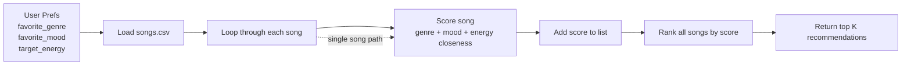

# 🎵 Music Recommender Simulation

## Project Summary

In this project you will build and explain a small music recommender system.

Your goal is to:

- Represent songs and a user "taste profile" as data
- Design a scoring rule that turns that data into recommendations
- Evaluate what your system gets right and wrong
- Reflect on how this mirrors real world AI recommenders

Replace this paragraph with your own summary of what your version does.

---

## How The System Works

Real-world systems like Spotify and YouTube mix collaborative filtering and content-based filtering. Collaborative filtering learns from behavior such as likes, skips, replays, playlist adds, and listening history across many users. Content-based filtering looks at the song itself, using features like genre, mood, energy, tempo_bpm, and danceability. My simulator focuses on content-based filtering because the catalog is small and I want a scoring rule that is easy to explain.

My `Song` objects use these features: `genre`, `mood`, `energy`, `tempo_bpm`, and `danceability`. My `UserProfile` stores `favorite_genre`, `favorite_mood`, and `target_energy`. The recommender will score each song with a simple algorithm recipe: +2.0 points for a genre match, +1.0 point for a mood match, and extra points when the song’s energy is close to the user’s target energy. If I want to go a little deeper, I can also give small bonus points for tempo and danceability when they support the same vibe.

This system might over-prioritize genre if I make that weight too strong, which could cause it to miss songs that match the user’s mood and energy better. It may also reflect the tastes of a tiny starter catalog instead of a broad real-world audience.

Data flow:

- Input: user preferences like favorite genre, favorite mood, and target energy
- Process: the recommender loops through every song in `songs.csv`, scores each one, and compares the score against the others
- Output: the songs are sorted into a ranked list and the top `k` recommendations are returned



Sample CLI output from `python -m src.main`:

```text
Loaded songs: 10

Top recommendations:

1. Sunrise City by Neon Echo
   Score: 4.96
   Reasons: genre match (+2.0); mood match (+1.0); energy closeness (+1.96)

2. Gym Hero by Max Pulse
   Score: 3.74
   Reasons: genre match (+2.0); energy closeness (+1.74)

3. Rooftop Lights by Indigo Parade
   Score: 2.92
   Reasons: mood match (+1.0); energy closeness (+1.92)

4. Night Drive Loop by Neon Echo
   Score: 1.90
   Reasons: energy closeness (+1.90)

5. Storm Runner by Voltline
   Score: 1.78
   Reasons: energy closeness (+1.78)
```

---

## Getting Started

### Setup

1. Create a virtual environment (optional but recommended):

   ```bash
   python -m venv .venv
   source .venv/bin/activate      # Mac or Linux
   .venv\Scripts\activate         # Windows

2. Install dependencies

```bash
pip install -r requirements.txt
```

3. Run the app:

```bash
python -m src.main
```

### Running Tests

Run the starter tests with:

```bash
pytest
```

You can add more tests in `tests/test_recommender.py`.

---

## Experiments You Tried

Use this section to document the experiments you ran. For example:

- What happened when you changed the weight on genre from 2.0 to 0.5
- What happened when you added tempo or valence to the score
- How did your system behave for different types of users

---

## Limitations and Risks

Summarize some limitations of your recommender.

Examples:

- It only works on a tiny catalog
- It does not understand lyrics or language
- It might over favor one genre or mood

You will go deeper on this in your model card.

---

## Reflection

Read and complete `model_card.md`:

[**Model Card**](model_card.md)

Write 1 to 2 paragraphs here about what you learned:

- about how recommenders turn data into predictions
- about where bias or unfairness could show up in systems like this


---

## 7. `model_card_template.md`

Combines reflection and model card framing from the Module 3 guidance. :contentReference[oaicite:2]{index=2}  

```markdown
# 🎧 Model Card - Music Recommender Simulation

## 1. Model Name

Give your recommender a name, for example:

> VibeFinder 1.0

---

## 2. Intended Use

- What is this system trying to do
- Who is it for

Example:

> This model suggests 3 to 5 songs from a small catalog based on a user's preferred genre, mood, and energy level. It is for classroom exploration only, not for real users.

---

## 3. How It Works (Short Explanation)

Describe your scoring logic in plain language.

- What features of each song does it consider
- What information about the user does it use
- How does it turn those into a number

Try to avoid code in this section, treat it like an explanation to a non programmer.

---

## 4. Data

Describe your dataset.

- How many songs are in `data/songs.csv`
- Did you add or remove any songs
- What kinds of genres or moods are represented
- Whose taste does this data mostly reflect

---

## 5. Strengths

Where does your recommender work well

You can think about:
- Situations where the top results "felt right"
- Particular user profiles it served well
- Simplicity or transparency benefits

---

## 6. Limitations and Bias

Where does your recommender struggle

Some prompts:
- Does it ignore some genres or moods
- Does it treat all users as if they have the same taste shape
- Is it biased toward high energy or one genre by default
- How could this be unfair if used in a real product

---

## 7. Evaluation

How did you check your system

Examples:
- You tried multiple user profiles and wrote down whether the results matched your expectations
- You compared your simulation to what a real app like Spotify or YouTube tends to recommend
- You wrote tests for your scoring logic

You do not need a numeric metric, but if you used one, explain what it measures.

---

## 8. Future Work

If you had more time, how would you improve this recommender

Examples:

- Add support for multiple users and "group vibe" recommendations
- Balance diversity of songs instead of always picking the closest match
- Use more features, like tempo ranges or lyric themes

---

## 9. Personal Reflection

A few sentences about what you learned:

- What surprised you about how your system behaved
- How did building this change how you think about real music recommenders
- Where do you think human judgment still matters, even if the model seems "smart"

