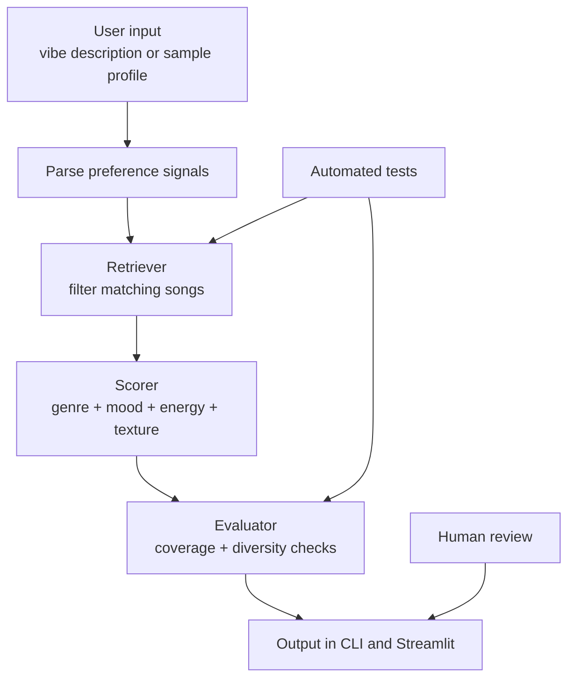

# Music Recommender+

## Original Project

The original project was the module 3 music recommender system. It ranked songs using simple features like genre, mood, and energy.

This submission is a direct extension of that project. I kept the song-ranking core and added a freeform vibe parser, explainable recommendations, and reliability checks so the system is easier to evaluate end to end.

## What This Project Does

This AI tool recommends songs from a small catalog based on a listening vibe. It first infers genre, mood, tempo, energy, and texture cues from a short prompt, then ranks songs and explains why each one fits.

Why this matters: small recommender projects are useful for showing how AI systems can turn a simple scoring rule into a transparent recommendation workflow.

## New in This Extension

- **RAG (Retrieval-Augmented Generation)**: Semantic search over song metadata using TF-IDF, allowing users to search songs by natural language descriptions, genre, or mood.
- **Explainable ranking**: Each recommendation includes a breakdown of which factors matched (genre +2.0, mood +1.5, energy +2.5, etc.).
- **Coverage & diversity checks**: The system ensures recommendations cover the inferred preferences and don't repeat the same artists/genres.

## System Design



## Setup

1. Create and activate a virtual environment.

```bash
python -m venv .venv
.venv\Scripts\activate
```

2. Install dependencies.

```bash
pip install -r requirements.txt
```

3. Run terminal demo.

```bash
python -m src.main
```

4. Run Streamlit app.

```bash
python -m streamlit run src/app.py
```

5. Run tests.

```bash
pytest
```

## Sample Inputs and Outputs

## Using the Streamlit App

The Streamlit UI (step 4 above) includes:

- **Vibe Input**: Describe the listening vibe in your own words
- **RAG Song Search** (sidebar): Three search modes:
    - **Semantic Query**: Type a description like "upbeat pop for running" to find songs by meaning
    - **Genre**: Search by genre (pop, lofi, rock, etc.)
    - **Mood**: Search by mood (happy, chill, intense, etc.)
- **Playlist tab**: See recommended songs with scores
- **Evidence tab**: View why each song was chosen (factors that matched)
- **Reliability tab**: Check system confidence and diversity of results

## Sample Inputs and Outputs

### RAG Search Example

Query: "upbeat pop music"

Results:
- Sunrise City (pop, happy) - score: 0.342
- Gym Hero (pop, intense) - score: 0.324  
- Rooftop Lights (indie pop, happy) - score: 0.297

### Example 1

Input:

```text
Bright pop and happy workout energy.
```

Output:

```text
Top matches: Sunrise City, Gym Hero, Rooftop Lights
Reasons: genre match, mood match, energy closeness
```

### Example 2

Input:

```text
Chill lofi focus music for studying late at night with soft, acoustic textures.
```

Output:

```text
Top matches: Library Rain, Midnight Coding, Focus Flow
Reasons: genre match, mood match, acoustic texture match
```

### Example 3

Input:

```text
Deep intense rock with driving guitars, powerful energy, and a heavy sound.
```

Output:

```text
Top matches: Storm Runner, Gym Hero, Night Drive Loop
Reasons: genre match, mood match, energy closeness
```

## Reliability and Testing

- 4/4 automated tests pass.
- The app logs key steps for loading, parsing, scoring, and evaluation.
- Coverage and diversity scores make it easier to explain why the shortlist looks good.
- Human review is still useful because a tiny catalog can overfit to a few obvious matches.

## Reflection and Ethics (Student Voice)

- Limitation: the catalog is tiny, so the recommender can only model a few taste patterns.
- Bias risk: genre and mood keywords can overweight obvious matches and ignore quieter fits.
- Misuse risk: the system may make the recommendations feel more certain than the catalog really supports.
- Mitigation: show the reasons, surface coverage and diversity checks, and keep the output explainable.
- Surprise: a simple scoring rule still feels surprisingly smart when the reasons are visible.

AI collaboration notes:

- Helpful: AI suggested a retrieval-first workflow that made the recommender easier to test and explain.
- Helpful: adding a freeform vibe parser made the project feel more like an actual AI extension of the original recommender.
- Flawed: a pure keyword score can still over-favor one strong attribute, so the ranking needs diversity and coverage checks.

## Key Files

- [CLI demo](src/main.py)
- [Streamlit UI](src/app.py)
- [Core logic](src/recommender.py)
- [Tests](tests/test_recommender.py)
- [Model card](model_card.md)
